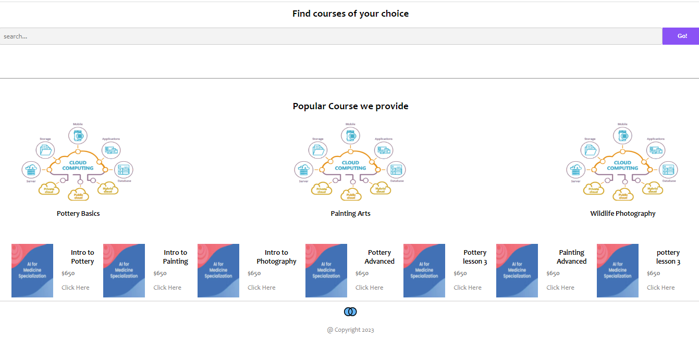

Union Art School Pricing Calculator App - Sequelize & PostgreSQL

This project is a pricing calculator application that provides dynamic pricing based on the selected courses. It utilizes the Sequelize ORM (Object-Relational Mapping) and PostgreSQL database to manage and store course data.

Features:
- Course selection: Users can choose courses from a list of options.
- Dynamic pricing: The app calculates the total price based on the selected courses.
- Database integration: The application uses Sequelize as an ORM to interact with the PostgreSQL database.
- User authentication: Users can register, login, and manage their profiles.
- Course management: Administrators can add, edit, and delete courses from the database.

Technologies Used:
- Node.js
- Express.js
- Sequelize (ORM)
- PostgreSQL
- HTML/CSS
- JavaScript

Getting Started:
1. Clone the repository
2. Install dependencies using npm or yarn
3. Set up the PostgreSQL database and update the configuration
4. Run the server
5. Access the application in a web browser

Folder Structure:
- controllers: Contains the route handlers and controllers for the application.
- models: Defines the Sequelize models and database schemas.
- routes: Contains the API routes for the application.
- views: Includes the HTML templates for rendering the frontend.
- config: Stores configuration files for the database and other settings.

Contributing:
Contributions to the project are welcome. If you have any suggestions or would like to contribute, please open an issue or submit a pull request.

